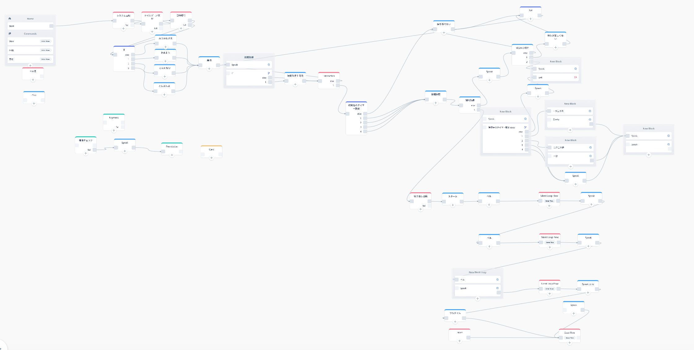

## 20191221vuifukuoka
---
### 自己紹介
- 氏名
- voice ui歴 2019/07〜
- 裏方でサポートする方が向いてるとおもう
---
## アイデアってどう生まれます？
---
### 状況から考えてみた時
@ul[...](false)
- 手が使えない
  - 物を持ってる、濡れてる
- 目が使えない
  - 真っ暗（電気がついていない）
  - 視線を外せない
- 聞くだけ良い時
@ulend
---
### ふとした時
@ul[...](false)
- プレゼンのタイムキーパ
- 次の日の準備
- 博多手一本締の音頭をとる人
@ulend
---
## つくれそう！
---
### と思って作り始めても、 色々インプットされてくる
@ul
- 挨拶は入れた方がいいかな
- ここは選択させたら広がるかな
- 待てないの？
- 再生できる音声の数が決まってるの？
- パーソナライズした方がいいらしいよ
- 課金できるってよ
@ulend
---
@snap[text-left]
### 思いつきで作り始めると大変な事に

@snapend
---
## いったん落ち着こう
---
@snap[north-west text-left]
### スキルについて整理する
@snapend
- 誰が使うの？|
- どこで使うの？|
- それで嬉しいの？|
- それ音声である必要があるの？|
---
## ペルソナ
---
@snap[west]
### ペルソナ
商品・サービスを利用する顧客の中で、最も重要な人物モデル
リアリティのある詳細な情報を設定していく
@snapend
---
@snap[north]
### 博多手一本
@snapend
@snap[west span-45 text-left text-08]
- ４０歳、男性
- 福岡の企業の課長
- ジモティ
- 初めて忘年会のトリを任される
@snapend
@snap[east span-45 text-left text-08]
- 23歳、女性
- 熊本から福岡の企業に就職
- 歴史好き
- 忘年会スルーはしない
@snapend
---
---
@snap[north]
#### 博多手一本
@snapend
@snap[west span-45]
@box[bg-green rounded box-padding](誰が使うの？#音頭を取る練習をしたい人。一人)
@snapend
@snap[west span-45]
@box[bg-green rounded box-padding](どこで使うの？#自分の部屋)
@snapend
@snap[east span-45]
@box[bg-orange rounded box-padding](誰が使うの？#手拍子の練習をしたい人。同僚と一緒に)
@snapend
@snap[east span-45]
@box[bg-orange rounded box-padding](どこで使うの？#定時後の会議室)
@snapend
---
### 嬉しいのか
---
@snap[north-west text-left]
## title2
@snapend
### title3
#### title4
##### title5
本文
- list
 - list2
1. listno
 1. listno2
@ul[list-square-bullets list-spaced-bullets](false)
- bullet1
- bullet2
@ulend
@table[table-header custom-header custom-row custom-spacing](path/to/sample.csv)
---
